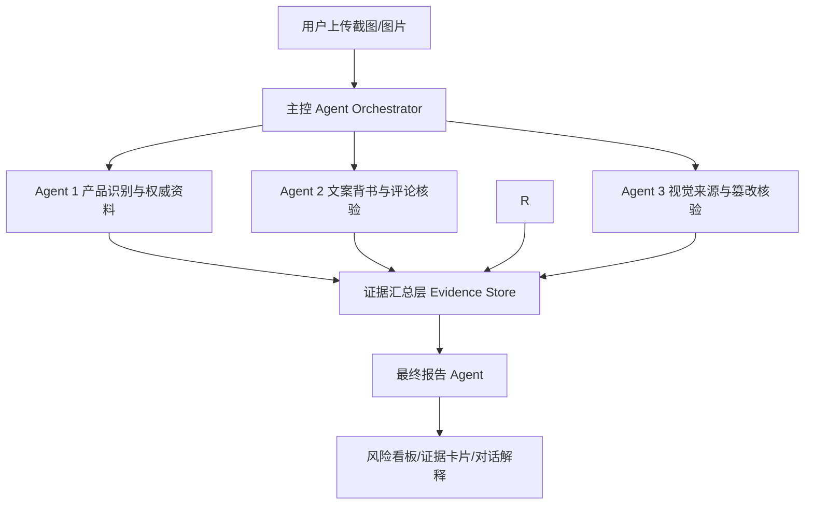

# 欧莱雅信任守护师：初步 Agent 架构设计书

版本：V0.1  
本周目标：确定 Agent 边界、输入输出协议和一条可演示的数据流

## 1. 产品定位

系统接收用户上传的商品截图、种草笔记截图、评论区截图、产品包装图片或功效对比图片，以“识别产品并核对产品事实”为主线，判断内容是否存在误导、伪造或异常。

系统不把“笔记真假”作为唯一问题，而是回答：

> 这张图或这段内容指向什么产品？它声称了什么？这些声明是否能被官方成分、备案和权威资料支持？平台内容是否存在异常模式？

## 2. Agent 总体结构



主控 Agent 负责拆解任务和调度；三个工作 Agent 分别对应三位计算机成员，负责独立判断；最终报告 Agent 是主控流程中的汇总步骤，不单独占用一名成员。Agent 之间通过结构化 JSON 传递结果，不直接传递长篇自然语言。

## 3. 三人开发分工

### 队员 A：产品识别与资料核验 Agent

职责：

- 从截图中识别品牌、产品、系列、规格和包装版本；
- OCR 提取产品名称、成分、备案号和功效文字；
- 建立产品候选列表和匹配置信度；
- 查询官方产品页、国家备案/注册、官方成分表；
- 整理论文、国际数据库和第三方报告；
- 输出产品事实卡和权威证据卡。

输入：截图、产品图片、OCR 文本。  
输出：`ProductIdentityResult`。

```json
{
  "product_id": "P001",
  "brand": "理肤泉",
  "product_name": "B5多效修复霜",
  "match_confidence": 0.91,
  "candidate_products": [],
  "ingredients": [],
  "official_claims": [],
  "registration": {},
  "sources": [],
  "uncertainties": []
}
```

### 队员 B：文案、背书与评论核验 Agent

职责：

- 从种草截图中提取功效、数字、时间、适用人群和专家背书；
- 将声明拆成可验证的 Claim；
- 对接淘宝/天猫评论接口或本地评论样本；
- 判断模板重复、评论集中、评分异常、追评异常和跨平台重复；
- 判断评论是否与官方成分或产品限制冲突。

输入：笔记截图、评论区截图、产品事实卡、评论结构化数据。  
输出：`ContentReviewResult`。

```json
{
  "claims": [
    {
      "text": "7天彻底修复屏障",
      "claim_type": "efficacy",
      "conflict_with_official": true,
      "evidence": "官方资料没有7天时间承诺",
      "risk": "high"
    }
  ],
  "endorsement_check": {},
  "comment_anomaly": {
    "duplicate_ratio": 0.34,
    "burst_window_minutes": 8,
    "rating_skew": 0.93,
    "follow_up_anomaly": true
  }
}
```

### 队员 C：视觉核验与报告 Agent

职责：

- 判断产品图片是否与识别结果一致；
- 检测前后对比图拼接、光影差异、皮肤纹理异常和包装文字修改；
- 判断图片是实拍、AIGC 生成还是局部编辑；
- 设计篡改区域可视化和证据热区；
- 负责最终报告 Agent、风险等级和页面结果组件。

输入：产品图、前后对比图、截图、产品事实卡、其他 Agent 结果。  
输出：`VisualReviewResult` 和 `FinalTrustReport`。

```json
{
  "source_type": "edited_photo",
  "tamper_probability": 0.82,
  "regions": [
    {
      "label": "left_cheek",
      "reason": "纹理过度平滑，边缘过渡异常",
      "bbox": [120, 220, 360, 480]
    }
  ],
  "lighting_inconsistency": true,
  "packaging_text_issue": false
}
```

## 4. 主控 Agent 的调度逻辑

主控 Agent 只做四件事：识别输入类型、调用产品 Agent、并行调用另外两个核验 Agent、处理失败和不确定性。产品识别成功后，Agent 2 和 Agent 3 并行工作；最终报告 Agent 在三路结果齐备后汇总。

```text
1. 判断用户上传的是商品截图、笔记截图、评论截图、单图或多图
2. 调用产品识别 Agent，得到 product_id 和匹配置信度
3. 若置信度 < 0.70，要求用户补充产品正面图或产品名称
4. 置信度足够后，查询产品资料库
5. 并行调用文案/背书/评论核验和视觉核验
6. 将结果写入 Evidence Store
7. 调用最终报告 Agent
8. 返回报告、证据和下一步建议
```

## 5. 证据等级和决策规则

证据按来源等级保存：

| 等级 | 来源 | 用途 |
|---|---|---|
| L1 | 国家备案/注册、品牌官方页面、官方成分表 | 产品身份和官方事实 |
| L2 | 官方实验、检测说明 | 官方功效依据 |
| L3 | 论文、PubMed、CosIng、SCCS | 成分和机理辅助依据 |
| L4 | 可核验第三方报告 | 外部佐证 |
| L5 | 淘宝、天猫、小红书内容和评论 | 风险线索和用户反馈 |
| L6 | 模型视觉或语言推断 | 辅助判断，不能单独定案 |

最终结论不得仅由 L5 或 L6 证据直接证明产品功效。多个 Agent 结论冲突时，报告中同时展示冲突，不强行生成确定性结论。

风险建议：

- 高风险：存在明确官方冲突、虚假背书或多项异常证据；
- 中风险：存在可疑声明、评论模式或视觉异常，但证据不完整；
- 低风险：未发现明显冲突，或仅有轻微平台噪声；
- 无法确认：产品身份或关键证据不足。

## 6. 页面需要展示的结果

首屏只展示用户最关心的内容：


- 产品识别卡：产品图片、名称、规格、匹配置信度；
- 信源等级条：官方、备案、报告、平台内容分别有多少条；
- 风险结论：高/中/低/无法确认；
- 三个核验卡片：声明、评论、视觉；
- 证据展开：原文片段、官方对照、来源链接；
- 图片热区：框选疑似篡改区域；
- 对话追问：例如“你要查看成分冲突，还是查看评论异常？”

## 7. 示例数据流转

演示输入使用 `demo/product-input-screenshot.svg`，内容模拟一张商品种草截图：产品图指向 B5 多效修复霜，文案声称“7 天彻底修复屏障”，下方附有评论区片段。

```text
截图
→ OCR：提取“B5多效修复霜”“7天彻底修复屏障”
→ 产品 Agent：匹配 P001，置信度 0.91
→ 资料查询：官方页面有“帮助修护干燥不适”，没有“7天彻底修复”
→ 声明 Agent：识别功效时间夸大，高风险
→ 评论 Agent：识别 8 分钟内 12 条相似五星评论，中风险
→ 视觉 Agent：产品图未发现篡改，图片可信度较高
→ 报告 Agent：总体中高风险，建议人工复核文案和评论来源
```

## 8. 本周需要完成的初步产出

- 三个 Agent 的输入输出 JSON 协议；
- 20 个产品的资料库字段定义和首批样例；
- S1、S2、S3 各一条可运行的测试流程；
- 产品识别、声明核验、评论异常、视觉核验的最小可用调用链；
- 一个能上传截图并展示数据流的页面原型；
- 一份最终报告样例，包含来源等级和不确定性说明。

## 9. Agent 工具边界

每个 Agent 只调用与自身职责相关的工具，避免多个 Agent 重复检索或互相覆盖结论。

| Agent | 必须使用的工具 | 不负责的事情 |
|---|---|---|
| Agent 1 产品识别与权威资料 | OCR、图片特征匹配、产品资料库、官方网页检索、备案查询 | 不判断评论灌水，不直接判断图片是否 AIGC |
| Agent 2 文案/背书与评论 | 文本抽取、声明分类、淘宝/天猫评论查询、相似度和时间统计、背书来源检索 | 不修改产品身份，不对图片像素作最终判断 |
| Agent 3 视觉与报告 | 图像篡改检测、AIGC 识别、差异图/掩码生成、报告模板渲染 | 不把平台评论当成权威功效证据 |
| 主控 Agent | 文件类型识别、任务状态管理、并行调度、重试和降级 | 不自行补充没有来源的事实 |
| 最终报告步骤 | 证据排序、冲突处理、风险分级、建议生成 | 不覆盖下游 Agent 的原始证据 |

## 10. Agent 交接协议

所有 Agent 通过统一任务对象交接：

```json
{
  "task_id": "task_001",
  "product_id": "P001",
  "source_assets": ["upload_01.png"],
  "findings": [],
  "evidence": [],
  "confidence": 0.0,
  "status": "ok",
  "uncertainties": [],
  "next_action": null
}
```

每条发现都要包含：

```json
{
  "finding_id": "F001",
  "agent": "claim_agent",
  "statement": "截图声称7天彻底修复屏障",
  "evidence_asset": "upload_01.png",
  "source_level": "L5",
  "supporting_source": "official_product_page",
  "confidence": 0.88,
  "severity": "high"
}
```

这样最终报告能够区分“截图中看到了什么”“官方资料支持什么”和“模型推断了什么”。

## 11. 失败和不确定性处理

### 产品无法确认

如果 Agent 1 的最高候选置信度低于 0.70，主控 Agent 不继续生成确定性结论，页面提示用户补充产品正面图、背面成分图或产品名称。

### 权威资料无法访问

保留已缓存的官方页面和采集时间；如果只有平台内容，报告标记为“低信源线索”，不得输出“官方已证实”。

### 评论接口不可用

使用本地脱敏评论样本完成演示，同时在报告中显示“平台实时评论未连接”；评论异常模块仍可以对用户上传的评论截图进行分析。

### 视觉模型置信度不足

不输出“图片一定造假”，而是输出“存在疑似区域/无法确认”，并展示光影、纹理或边缘异常作为待复核证据。

### Agent 结果相互冲突

最终报告保留冲突信息。例如视觉 Agent 判定图片可疑，但产品 Agent 只能确认包装身份时，报告写成“产品身份可确认，图片来源仍需人工复核”。

## 12. 现场演示脚本

演示只使用一张截图即可完成主链路：

1. 上传 `demo/product-input-screenshot.png`；
2. 页面展示 OCR 结果和产品候选；
3. Agent 1 返回产品资料和官方证据；
4. Agent 2 并行显示功效时间冲突和评论模板异常；
5. Agent 3 显示图片未发现明确篡改或给出视觉证据；
6. 最终报告汇总风险等级、证据等级和建议；
7. 点击“为什么”查看原文、官方对照和模型理由。

现场必须明确说明：截图是低信源输入，产品官方资料是主要事实依据，评论和图片只用于风险辅助判断。
