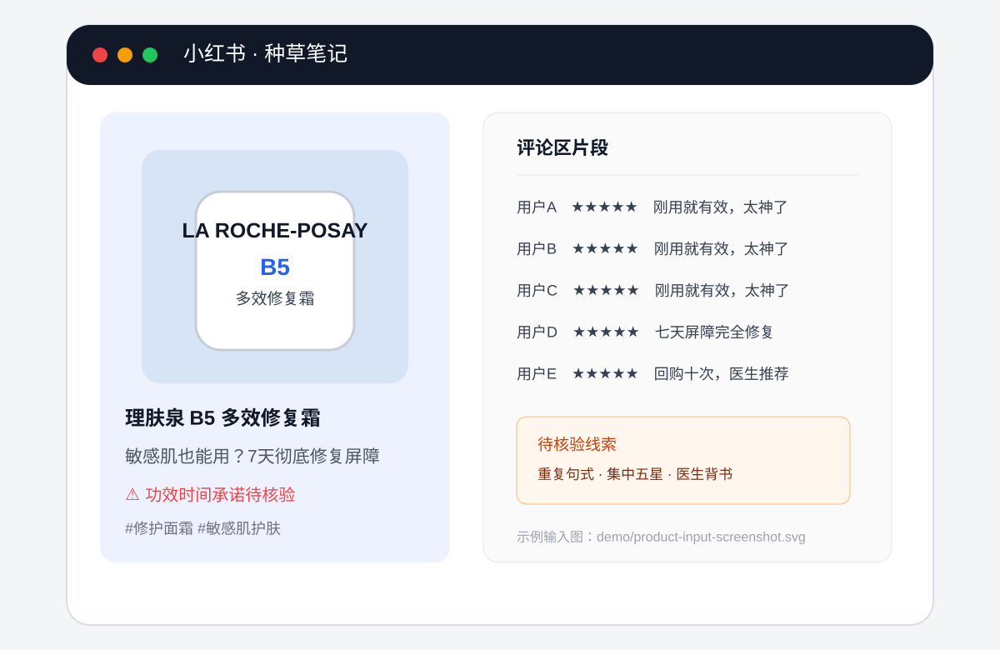

# 产品截图数据流演示

## 输入截图



这张示例图模拟用户上传一张小红书种草截图，包含产品包装、产品名称、功效声明和评论片段。它不是权威证据，只是触发核验流程的低信源输入。

## 数据流

```text
1. 用户上传 product-input-screenshot.svg
2. OCR/视觉解析提取：理肤泉、B5、多效修复霜、7天彻底修复屏障、五星评论
3. Agent 1 输出产品候选 P001，匹配置信度 0.91
4. Agent 1 查询 P001 的官方产品页、成分表、备案和权威资料
5. Agent 2 检查：
   - “7天彻底修复屏障”是否超过官方表述
   - “医生推荐”是否存在可核验来源
   - 评论是否出现重复句式和短时集中
6. Agent 3 检查：
   - 产品包装是否被修改
   - 图片是否存在生成或拼接痕迹
   - 画面中的产品是否与 P001 匹配
7. Evidence Store 保存三路结果和来源等级
8. Final Report Agent 输出风险等级、证据卡和建议
```

## 中间结果示例

```json
{
  "task_id": "task_demo_001",
  "product": {
    "product_id": "P001",
    "name": "理肤泉 B5 多效修复霜",
    "confidence": 0.91
  },
  "official_evidence": [
    {
      "level": "L1",
      "source": "品牌官方产品页",
      "finding": "官方表述为帮助修护干燥不适，未提供7天彻底修复承诺"
    }
  ],
  "claim_review": {
    "risk": "high",
    "finding": "功效程度和时间被夸大"
  },
  "comment_review": {
    "risk": "medium",
    "finding": "评论片段出现重复句式，需查看完整评论区"
  },
  "visual_review": {
    "risk": "low",
    "finding": "当前图片未发现明确篡改证据"
  },
  "final": {
    "risk": "medium_high",
    "action": "提示谨慎，并建议人工复核文案和评论来源"
  }
}
```

## 页面展示顺序

页面按照“先产品、后证据、再风险”的顺序展示：

```text
产品识别卡
→ 官方资料卡
→ 文案/背书核验卡
→ 评论异常卡
→ 图片鉴伪卡
→ 总体风险和建议
```

这样用户可以区分：产品事实来自哪里，平台内容发现了什么风险，模型哪些判断仍然需要人工复核。
