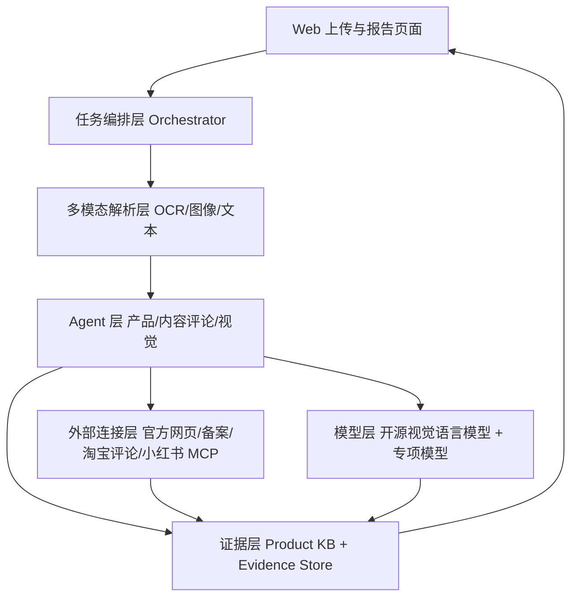

# 欧莱雅信任守护师：初步产品架构书

版本：V0.1  
定位：面向美妆护肤图文内容的产品中心真实性核验工作台

## 1. 架构目标

产品架构围绕一条主链路展开：

```text
截图/图片输入
→ 识别产品
→ 建立产品事实基线
→ 核验文案、评论和图片
→ 汇总证据
→ 输出可解释报告
```

架构需要满足四点：

- 以产品身份作为所有数据的关联主键；
- 权威资料和官方信息优先于平台内容；
- 三类攻击面可以独立执行，也可以并行执行；
- 每一个结论都能追溯到输入图、提取片段和来源链接。

## 2. 系统分层



### 2.1 表现层

网页负责上传、任务状态、证据卡片、图片热区和最终报告。表现层不直接调用平台接口，所有请求经过后端任务接口。

### 2.2 任务编排层

编排层负责：

- 创建 `task_id`；
- 判断输入类型；
- 调度产品识别；
- 在产品识别成功后并行调用内容/评论 Agent 和视觉 Agent；
- 控制超时、重试和降级；
- 将结果写入证据汇总层；
- 调用最终报告步骤。

### 2.3 多模态解析层

解析层包含：

- 图片格式校验和压缩；
- OCR 文字识别；
- 页面区域检测；
- 产品包装区域裁剪；
- 评论卡片和评分区域检测；
- 前后对比图配对；
- 文本、图片和来源的统一编号。

### 2.4 Agent 层

系统只保留三个工作 Agent，对应三位成员：

| Agent | 输入 | 输出 |
|---|---|---|
| 产品识别与权威资料 Agent | 商品截图、包装图、OCR 文本 | `ProductIdentityResult`、产品事实卡 |
| 文案/背书与评论核验 Agent | 种草截图、背书截图、评论截图 | `ContentReviewResult`、评论统计和冲突 |
| 视觉鉴伪与报告 Agent | 产品图、对比图、截图、前两路结果 | `VisualReviewResult`、最终报告 |

主控 Agent 和 Evidence Store 属于平台基础能力，不作为额外成员分工。

## 3. 数据存储设计

### 3.1 产品知识库 Product KB

按 `product_id` 存储：

```text
product_id
brand
product_name
aliases
category
specification
official_claims
ingredients
registration
official_images
authoritative_sources
updated_at
```

### 3.2 任务库 Task Store

```text
task_id
user_assets
detected_platform
product_id
status
created_at
completed_at
error_code
```

### 3.3 证据库 Evidence Store

所有 Agent 的发现统一存储：

```text
finding_id
task_id
agent_name
statement
evidence_asset
source_level
source_url
confidence
severity
created_at
```

证据库保留原始发现，不允许最终报告覆盖原始结果。报告只是对证据排序和解释。

## 4. 外部连接和 MCP 设计

外部连接采用适配器接口，避免平台变化影响 Agent 核心逻辑：

```text
OfficialSourceAdapter
RegistrationAdapter
TaobaoReviewAdapter
XiaohongshuAdapter
PaperSourceAdapter
```

每个适配器统一返回：

```json
{
  "source_id": "src_001",
  "source_type": "official_product_page",
  "source_level": "L1",
  "url": "https://example.com",
  "retrieved_at": "2026-09-15T10:00:00+08:00",
  "content": "页面或接口返回内容",
  "availability": "available"
}
```

淘宝/天猫评论作为主要评论连接，优先使用可查询商品评价的接口。小红书 MCP 用于种草笔记和评论辅助，不作为产品事实的唯一来源。接口不可用时，系统使用本地脱敏快照，并在报告中显示数据来源状态。

## 5. 请求生命周期

```text
POST /api/tasks
  ↓
task.status = received
  ↓
POST /api/tasks/{id}/identify
  ↓
task.status = identifying
  ↓
product_id 确认
  ↓
并行执行 claim/comment/visual
  ↓
task.status = assembling_report
  ↓
GET /api/tasks/{id}/report
  ↓
task.status = report_ready
```

建议接口：

```text
POST /api/tasks                 创建任务并上传图片
GET  /api/tasks/{task_id}       查看任务状态
GET  /api/tasks/{task_id}/evidence  查看证据
GET  /api/tasks/{task_id}/report    查看最终报告
POST /api/tasks/{task_id}/followup  追问报告
```

## 6. 部署形态

初赛采用轻量部署：

```text
Ubuntu 云服务器
├── Web 前端容器
├── API/Orchestrator 容器
├── OCR 与图片处理容器
├── SQLite/PostgreSQL
└── 本地文件或对象存储
```

模型优先使用云端可调用的开源模型服务或轻量推理接口。服务器负责页面、任务编排、缓存和证据整理，不把大模型权重强行放入 2 GiB 小实例。

## 7. 安全和隐私

- 用户上传图片使用随机文件名；
- 运行日志不保存完整用户原图；
- 评论截图中的头像、昵称、订单号和地址必须脱敏；
- 外部来源链接和采集时间保留，便于复核；
- 产品资料和测试样本分开存储；
- 测试集标注不进入生产任务输入。

## 8. 可观测性

每个任务记录：

```text
task_id
agent_name
开始时间
结束时间
调用工具
模型名称
输入图片数量
输出证据数量
失败原因
```

页面至少显示每个 Agent 的状态、耗时、证据数量和置信度，便于演示时说明系统不是一次性黑盒判断。

## 9. 架构取舍

本周采用“规则和检索优先、模型辅助”的实现方向：

- 产品识别依赖 OCR、候选匹配和产品资料库；
- 功效核验依赖声明抽取、官方对照和来源等级；
- 评论核验依赖统计特征、文本相似度和时间分布；
- 视觉核验依赖专门的视觉模型和可解释区域；
- 大模型负责理解、整合和生成报告，不独自决定所有事实。

本周不把本地微调作为前置条件。只有在测试样本显示某一类错误持续出现，并且已有足量标注数据时，才考虑对单一模块做轻量适配。

## 10. 架构验收标准

- 一张上传截图能生成唯一 `task_id`；
- 能从截图得到产品候选和置信度；
- 能按 `product_id` 读取产品资料；
- 三个工作 Agent 能接收统一任务对象并返回结构化结果；
- 所有发现都包含证据来源和置信度；
- 任一外部接口不可用时能降级到缓存或本地样例；
- 页面能展示产品事实、三类核验和最终报告；
- 失败时能向用户说明缺少什么信息。
